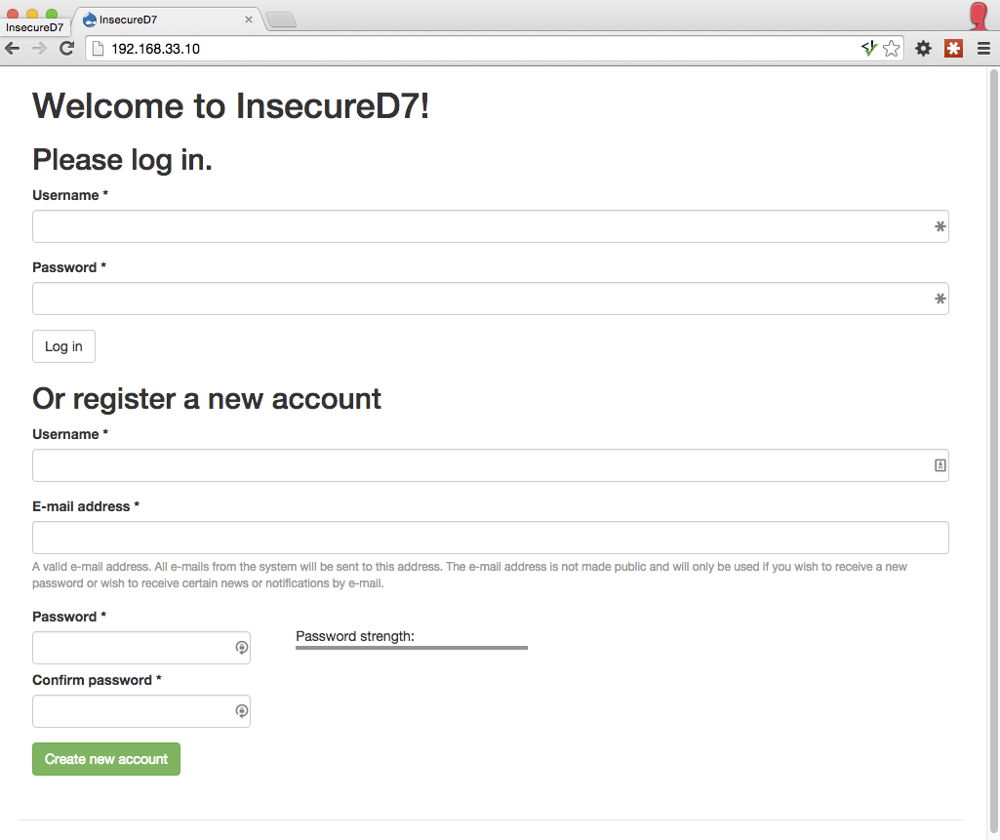
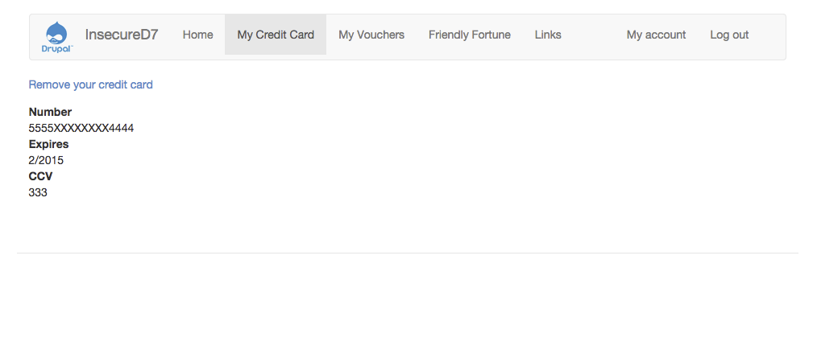
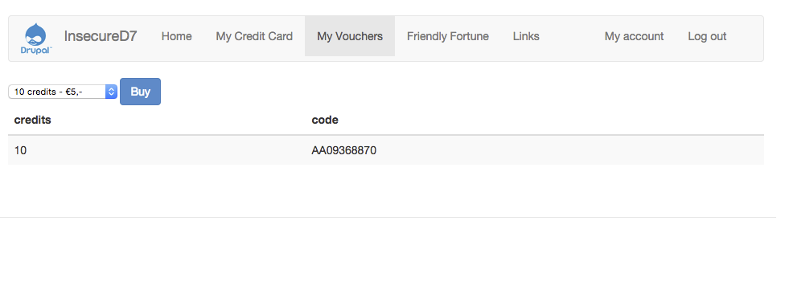
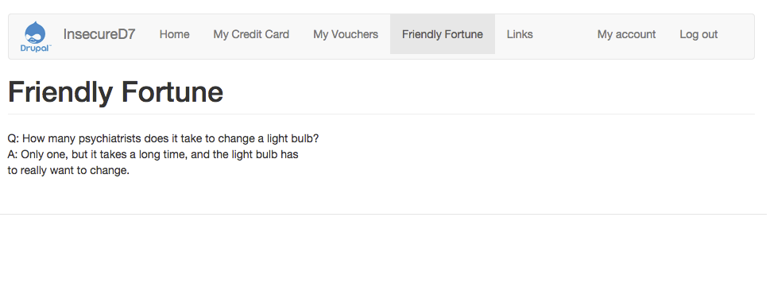
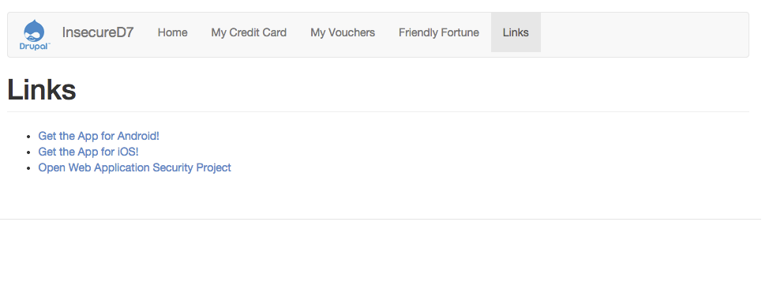

# InsecureD7
Deliberately insecure Drupal 7 installation (as used at the European Drupal Days 2015).

# Screenshots








# Setup

This installation uses 'Code Driven Development', to find out more take a look at [the Nuvole blog](http://nuvole.org/blog/code-driven-development).

```bash
git clone git@github.com:relaxnow/insecured7.git &&
cd insecured7 &&
vagrant up &&
vagrant ssh
```

Now on the VM run ```cd /vagrant && ant site-install``` and it should install the site for you.

# "I would never build a site like this!"

I hope not! This is a simplified example designed for easy teaching.
Real life vulnerabilities will most likely not be so glaringly obvious, however in principle they will be the same.

If you have any ideas on better show cases for a specific vulnerability, please [open an issue](https://github.com/relaxnow/insecured7/issues/new) or even better send me a [Pull Request](https://help.github.com/articles/using-pull-requests/).

# Vulnerabilities

This installation has been made to be deliberately vulnerable to the following:

* menu without logout
* unauthorised functions and services
* open URLs
* direct objects
* javascript access controls
* CSRF protections
* SS input validation & encoding
* SQL injection
* OS Command injection
* HTML escaping
* Information leakage
* Use URL to submit sensitive data
* request methods
* Click Jacking
* Unsafe redirects
* Path traversal
* No misconfigurations
* Does not use vulnerable libraries
