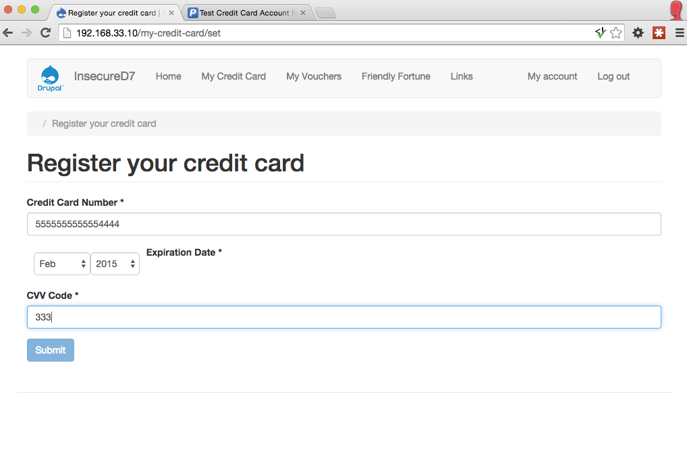

# InsecureD7
Deliberately insecure Drupal 7 installation (as used at the European Drupal Days 2015).

# Screenshots





# Setup

This installation uses 'Code Driven Development', to find out more take a look at [the Nuvole blog](http://nuvole.org/blog/code-driven-development).

```bash
git clone git@github.com:relaxnow/insecured7.git &&
cd insecured7 &&
vagrant up &&
vagrant ssh
```

# "I would never build a site like this!"

I hope not! This is a simplified example designed for easy teaching.
Real life vulnerabilities will most likely not be so glaringly obvious, however in principle they will be the same.

If you have any ideas on better show cases for a specific vulnerability, please [open an issue](https://github.com/relaxnow/insecured7/issues/new) or even better send me a [Pull Request](https://help.github.com/articles/using-pull-requests/).

# Vulnerabilities

This installation has been made to be deliberately vulnerable to the following [OWASP ASVS](https://www.owasp.org/index.php/Category:OWASP_Application_Security_Verification_Standard_Project) requirements:

* V2.16 Strongly encrypted transport
* V2.18 No username enumeration
* V3.3. Session times out after inactivity
* V3.5. Shows logout link
* V4.1. Authorisation of functions and services
* V4.2. Authorisation of URLs
* V4.4. Authorisation of direct object references
* V4.5. Directory browsing
* V4.6. Authorisation of data
* V4.11. Server side access controls
* V4.16. CSRF protection
* V5.5. Server side input validation and encoding
* V5.10. SQL Injection
* V5.12. OS Command Injection
* V5.16. HTML escaping
* V8.1. Information leakage
* V9.1. Sensitive data does not get cached
* V9.3. Sensitive data does not get sent in the URL
* V11.8. Click-Jacking defense
* V16.1. Safe from unsafe redirects
* V16.2. Safe from path traversal
* V17.16. No misconfigurations
* V17.17. Does not use vulnerable libraries
